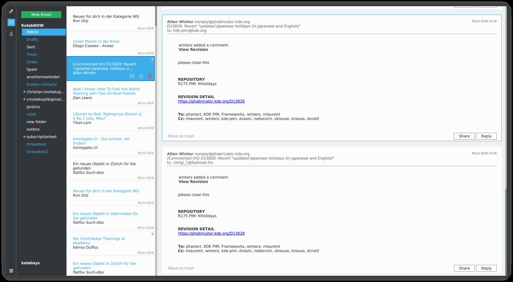

Nobody is happy with "groupware" applications, and many have fled to web applications as a result even though they offer a fraction of the possibilities a native application does and often means leaving your data in someone else's hands. Despite this low satisfaction, a modern alternative has yet to be offered.
This is the purpose of Kube: beautiful, modern communication in a reliable, high-performance native application for your desktop, laptop and mobile devices.

Kube is in early development but our goals are clear. To create a stable, understandable and effective communication and collaboration platform for end users and project managers alike. Our key-stone feature of the application is the email client, and that is our initial focus.

Kube is a modern communication and collaboration client built with [QtQuick](http://doc.qt.io/qt-5/qtquick-index.html) on top of a high performance, low resource usage [core](http://kube-sink.readthedocs.io/en/latest/design/). It provides online and offline access to all your mail and contacts. With a strong focus on usability, the team works with designers and UX experts from the ground up, to build a product that is not only visually appealing but also a joy to use.

* An easy to use and beautiful UI that let's you focus on what you need to accomplish.
* Fast and powerful when you need it, getting out of your way when you don't.
* Full offline access so you can rely on Kube no matter where you are.
* GPG based end-to-end encryption.
* Keyboard navigation to get around quickly.
* Fulltext search.

## Development

We're aiming to produce a product that does what it does well, even if that means not catering to all usecases. We want a codebase that is maintainable by a small team, and that  can move fast. We want it to be cheap and easy to prototype new features, without compromising the quality of the rest of the [system](http://kube.readthedocs.io/en/latest/design/). Last but not least, we want portability accross a variety of platforms, including mobile, not only witha portable codebase, but also with different UI's catering to the various formfactors.

For Developers:
* A small and concise codebase that is easy to modify and evolve.
* The UI is written completely in QtQuick, allowing for quick prototypes.
* Integration with third party applications:
    * Since components are self contained and made available as plugins, external applications can load fully functional Kube components.

